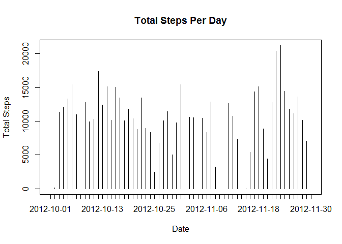
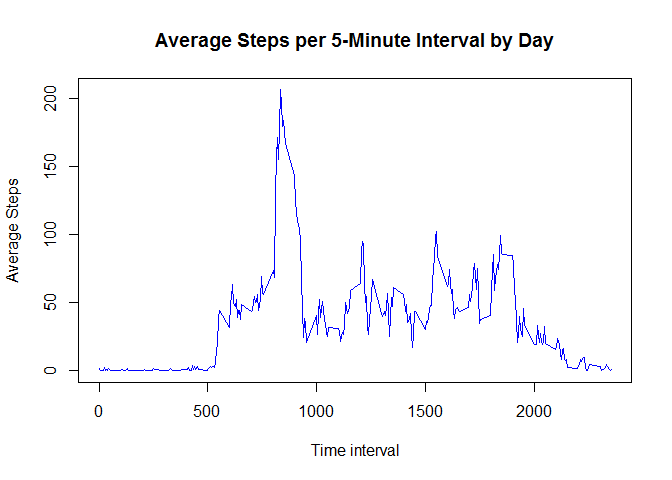
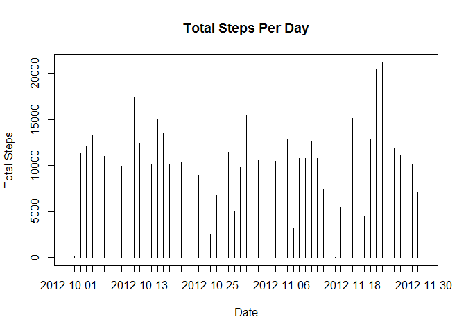

# Reproducible Research: Peer Assessment 1


## Loading and preprocessing the data

```r
###   Set working directory to where the data lives.
setwd("H:/BigStegShare/COURSERA/DataScience/ReproducibleData/")

###   Read in data.
FITDATA <- read.csv("activity.csv")
```

## What is mean total number of steps taken per day?

```r
#1:1. calculate sums of steps per day
new1 <- with (FITDATA, tapply(steps, date, sum))

#1:2. plot histogram
plot(new1, type = "h", xaxt = "n", xlab = "Date", ylab = "Total Steps")
axis(1, at=1:length(names(new1)), lab=names(new1))
title(main = "Total Steps Per Day" )
```



```r
#1:3. calculate mean and median of total number of steps taken per day
mean(new1, na.rm = TRUE)
```

```
## [1] 10766.19
```

```r
median(new1, na.rm = TRUE)
```

```
## [1] 10765
```

```r
#returns 10766.19 and 10765, respectively.
```

## What is the average daily activity pattern?

```r
library(dplyr)
```

```
## Warning: package 'dplyr' was built under R version 3.2.4
```

```
## 
## Attaching package: 'dplyr'
```

```
## The following objects are masked from 'package:stats':
## 
##     filter, lag
```

```
## The following objects are masked from 'package:base':
## 
##     intersect, setdiff, setequal, union
```

```r
#2:1. make a time-series plot of five-min intervals and average steps taken, averaged across all days.
#calculate sums per min interval
#new2 <- with (FITDATA, tapply(steps, interval, sum))
myMeans <- tapply(FITDATA$steps, FITDATA$interval, mean, na.rm = TRUE)
myIntervals <- names(myMeans)

#plot time-series based on intervals with means per interval
plot(names(myMeans), myMeans, type = "l", xlab = "Time interval",ylab = "Average Steps", col = "blue")
title(main = "Average Steps per 5-Minute Interval by Day" )
```



```r
#interval with max average steps:
#build dataframe with intervals and their means
newData <- data.frame(as.integer(myIntervals),myMeans)
colnames(newData) <- c("intervals","averageSteps")

#select max of the interval Means and show the interval with that mean.
maxMean <- max(newData$averageSteps)
maxMean
```

```
## [1] 206.1698
```

```r
newData[newData$averageSteps %in% maxMean,]$intervals
```

```
## [1] 835
```

```r
#another method of getting the data...
x <- which(newData == max(newData$averageSteps), arr.ind = TRUE)
newData[x[1],]
```

```
##     intervals averageSteps
## 835       835     206.1698
```

## Imputing missing values
###Note that there are a number of days/intervals where there are missing values (coded as NA). The presence of missing days may introduce bias into some calculations or summaries of the data.
###1.Calculate and report the total number of missing values in the dataset (i.e. the total number of rows with NAs)
###2.Devise a strategy for filling in all of the missing values in the dataset. The strategy does not need to be sophisticated. For example, you could use the mean/median for that day, or the mean for that 5-minute interval, etc.
###3.Create a new dataset that is equal to the original dataset but with the missing data filled in.
###4.Make a histogram of the total number of steps taken each day and Calculate and report the mean and median total number of steps taken per day. Do these values differ from the estimates from the first part of the assignment? What is the impact of imputing missing data on the estimates of the total daily number of steps?


```r
#3:1. Calculate total number of missing values in the dataset.
sum(!complete.cases(FITDATA))
```

```
## [1] 2304
```

```r
#3:2. Strategy for filling in missing values: 
# use interval mean.  This data is already stored in myMeans.

#3:3. Create a new dataset with NAs replaced by myMeans vals for their intervals.
good <- complete.cases(FITDATA)
FITDATA1 <- FITDATA
FITDATA1[!good,]$steps <- 5

#3:4  Do a histogram like in #1, but with the new data.

# calculate sums of steps per day
new1 <- with (FITDATA1, tapply(steps, date, sum))

# plot histogram
plot(new1, type = "h", xaxt = "n", xlab = "Date", ylab = "Total Steps")
axis(1, at=1:length(names(new1)), lab=names(new1))
title(main = "Total Steps Per Day" )
```



```r
# calculate mean and median of total number of steps taken per day
mean(new1, na.rm = TRUE)
```

```
## [1] 9543.082
```

```r
median(new1, na.rm = TRUE)
```

```
## [1] 10395
```

```r
#returns 10766.19 and 10765, respectively.
```

###3:4.1 Are the results different from #1?
    Yes
###3:4.2 What is the impact of imputing data?  
    Mean and median go up, since any imputed data is greater than zero.
    Histogram is denser than in #1 since there are more data points (NAs not removed).

## Are there differences in activity patterns between weekdays and weekends?
###add properly formatted date data to FITDATA1

```r
FITDATA1$date <- as.POSIXlt(FITDATA1$date)
```
